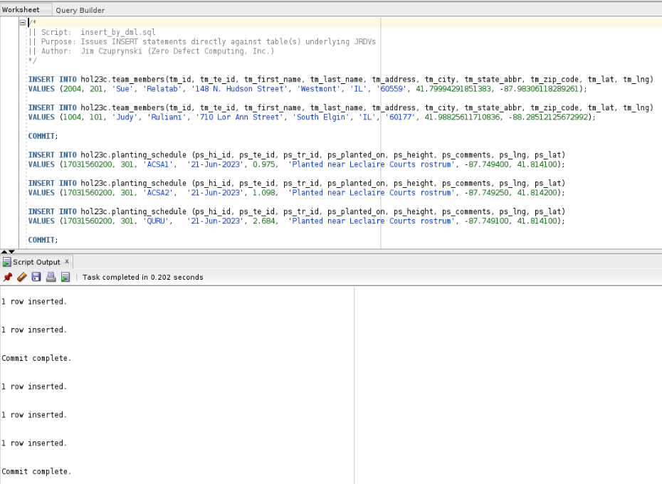
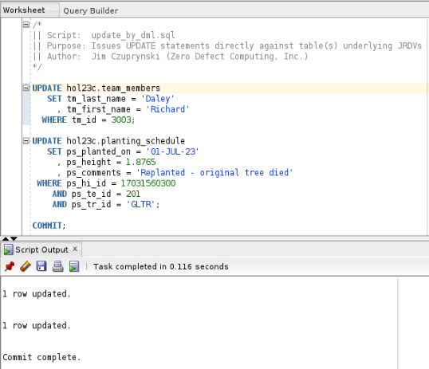
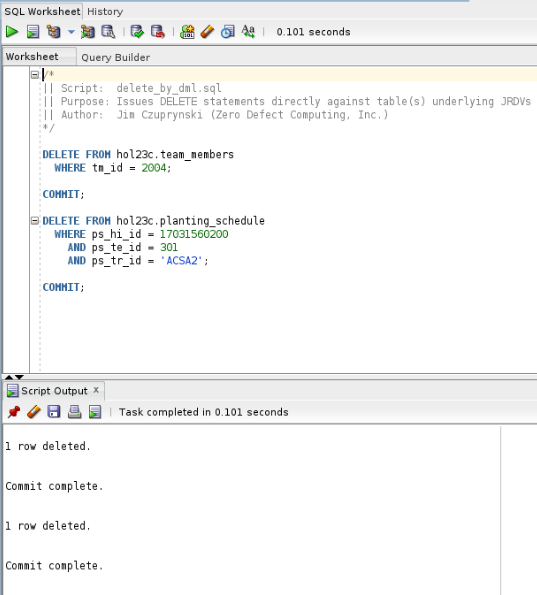
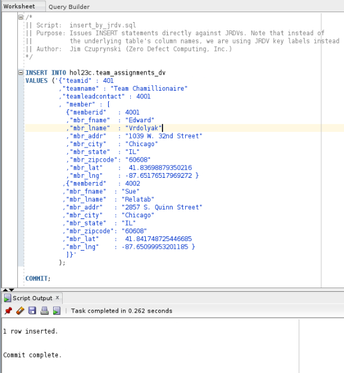
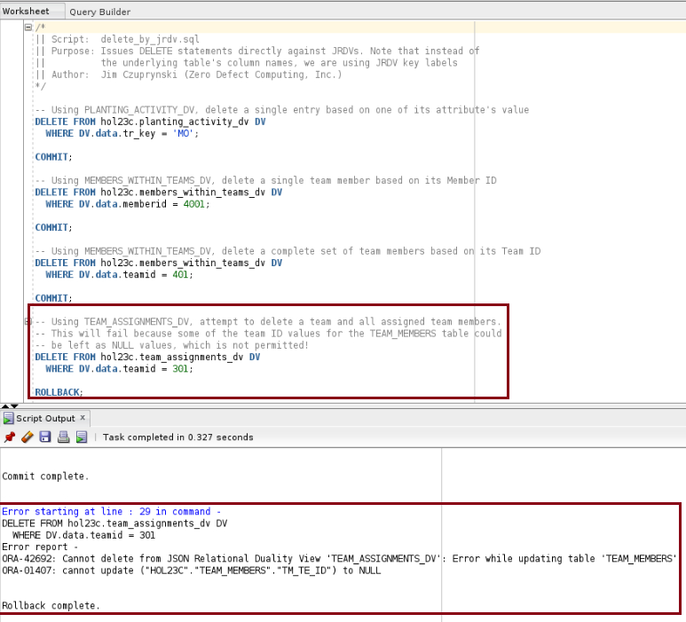

# Explore Feature Sets of JSON Relational Duality Views

## Introduction

This lab lets you explore the rich feature set of JSON Relational Duality Views (JRDVs) that you created earlier, including the ability to modify their underlying data ... or block users from modifying data with JRDV annotations.

Estimated Time: 25 minutes.

<!-- Watch the video below for a quick walk through of the lab. -->

<!-- update video link. Previous iteration:  -->

### Objectives
Learn how to:
- Use JSON to create, modify, and delete data within a JRDV's underlying tables
- Explore the optional limits that JRDVs can enforce against creating and modifying data

### Prerequisites
This lab assumes:
- You have already finished all prior labs
- You still have your SQL Developer session open from the prior lab step

## Task 1: Start ORDS and Configure REST-Enabled JRDVs

So that we can explore using CURL statements to add, modify, or delete data from JRDVs, we will first start Oracle REST Data Services (ORDS). We will then enable REST Services for one of our JRDVs.

1. Proceed to ...
{copy ORDS startup if needed}

2. Now we will enable REST Data Services at the schema level:

- From the left-hand menu in SQL Developer, select the **hol23c** connection, click the right mouse button and then select the **REST Services ... Enable REST Services** option:

    

- Check the *Enable schema* checkbox, uncheck the *Authorization required* checkbox, and then click Next.

    

- Review the Summary page and click Finish. 

    

3. Lastly, we will enable REST Data Services for the **planting_delivery_dv** JRDV:

- From the left-hand menu in SQL Developer, expand the *Views* tree node for the **hol23c** connection, select the **PLANTING_DELVERY_D**V object, click the right mouse button, and then select the **Enable REST Services** option:

    

- Check the *Enable object* checkbox, uncheck the *Authorization required* checkbox, and then click Next.

    

- Review the Summary page and click Finish. 

    

## Task 2: Managing JRDV Data Via Standard DML Against Underlying Tables

We will next explore methods for managing data that underlies some of our JRDVs by applying standard DML statements to the underlying tables. To perform each of these steps, use the *File...Open* button to open each file, select the **hol23c_freepdb1** database connection when prompted, and then execute the file's contents by pressing F5 or clicking on the *Run Script* button.

2. Let's add data by applying SQL DML statements directly against the JRDV's underlying tables. Open the file named **insert-by-dml.sql** and execute it:

    

3. We can also change existing data with a standard DML UPDATE statement against the JRDV's underlying tables. Open the file named **update-by-dml.sql** and execute it:

    

4. Finally, let's attempt to delete some of the data we just added with a standard DML DELETE statement against the JRDV's underlying tables. Open the file named **delete-by-dml.sql** and execute it:

    

## Task 3: Managing Data Via DML Applied Directly Against JRDVs

Some of the most impressive and unique characteristics of JRDVs are their capabilities for managing data by applying a SQL DML statements *directly against the JRDV itself.* Let's explore scenarios for adding, changing, and deleting data via these features. For all examples in this task, we will be using the **PLANTING_ACTIVITY_DV** JRDV.

1. First, let's add some new JRDV documents by applying a SQL INSERT statement *directly against the JRDV itself.*s

    

2. Updating data within JRDV documents is also possible - again, simply by applying a SQL UPDATE statement against the JRDV itself.

    

3. And of course, we can delete data within JRDVs by applying a SQL DELETE statement against the JRDV itself.

    

## Task 4: Managing Data Via HTTP Commands

Since we started ORDS successfully in Task #1, we can now explore how to use HTTP POST, PUT and DELETE commands to manage data within a JRDV. The obvious advantage of these methods is that a developer who is familiar with making HTTP calls to APIs to add, change, or delete data doesn't need to master SQL DML commands to execute any of these statements; instead, they can easily construct and issue appropriate GET, PUT, or DELETE command to perform those actions. 

1. We'll first add some new data into a JRDV using the HTTP POST command. First, open a new terminal window by clicking on the *File...New* Tab within one of your existing Terminal sessions. Then paste the following command string into the new terminal window and hit ENTER:

    

    The result that's returned shows the entire state of the new JRDV entry, including all of its corresponding components from all elements defined for the **PLANTING_ACTIVITY_DV** JRDV.

2. Now let's update some data within the JRDV via an HTTP PUT command. Issue the following command via CURL:

    

3. Finally, let's try to delete some data from one of our JRDV documents thru the HTTP DELETE command. Issue the following command via CURL:

    

## Task 5: Limit JRDVs From Undesired Data Manipulation

One extremely useful feature of JRDVs is that while they do permit data to be manipulated within them via DML or REST API calls, it's also possible to enforce tight limits on exactly which sections of the JRDV are allowed to be changed. We'll briefly explore this feature set now.

1. Open and execute the file named **prohibiting-jrdv-dml.sql.** It creates a new JRDV named **WONTWORK.** 

    

2. Next, pen and execute the file named **failing-jrdv-dml.sql** and review the results. You should see that the DML statement failed because {finish this narrative ...}

    

99. You have now completed this lab.

## Learn More
* [Oracle JSON Developer's Guide](https://docs.oracle.com/en/database/oracle/oracle-database/23/adjsn/)
* [Oracle JSON-Relational Duality Developer's Guide](https://docs.oracle.com/en/database/oracle/oracle-database/23/jsnvu/)

## Acknowledgements
* **Author** - Kaylien Phan, William Masdon, Jim Czuprynski
* **Contributors** - Jim Czuprynski, LiveLabs Contributor, Zero Defect Computing, Inc.
* **Last Updated By/Date** - Jim Czuprynski, July 2023