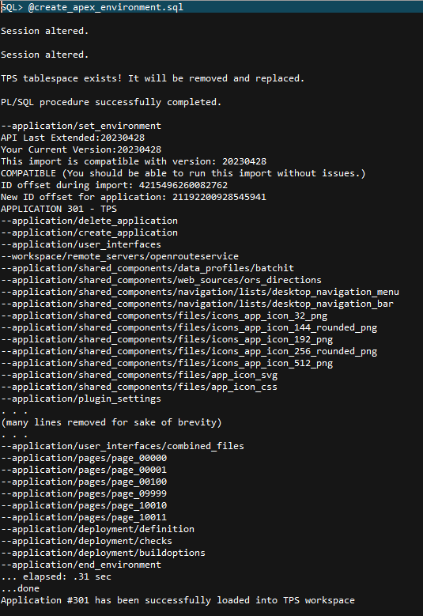
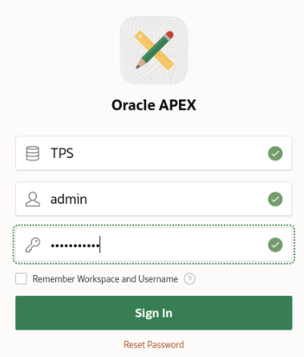
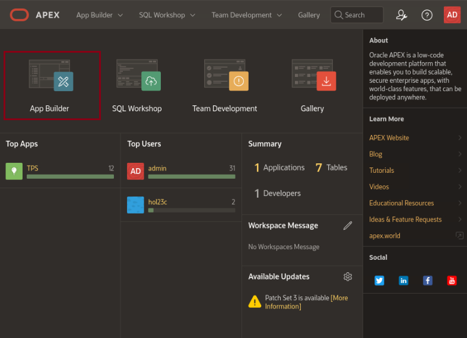
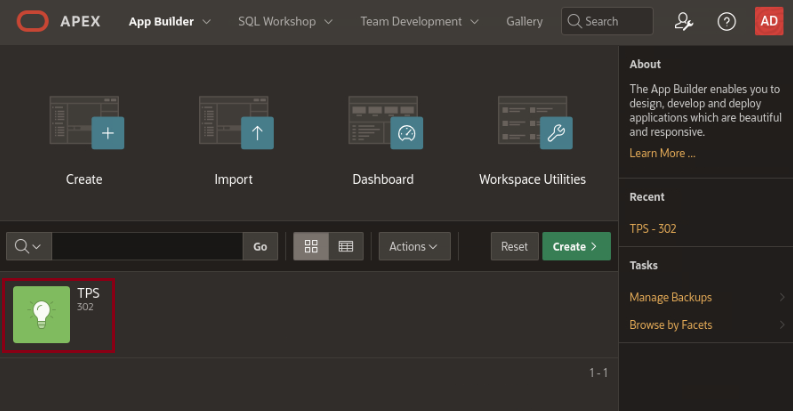
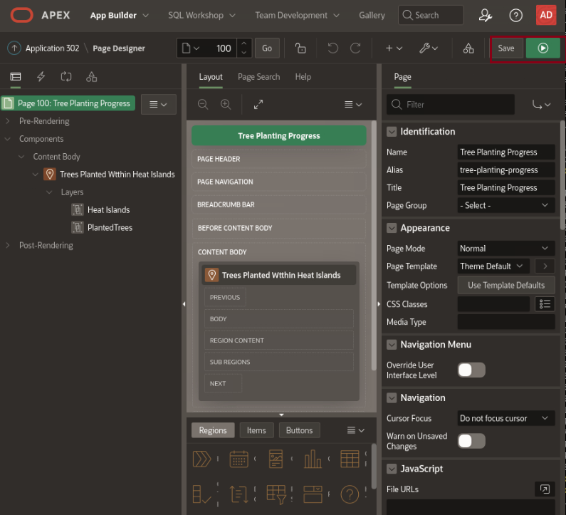
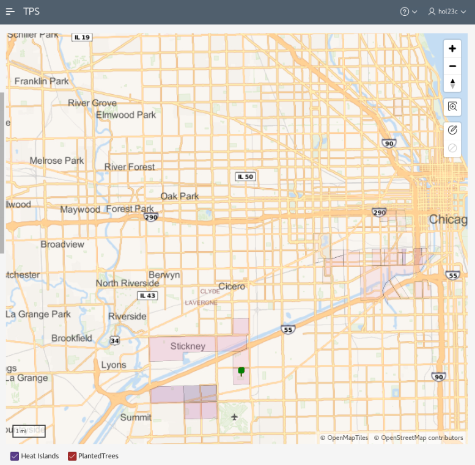
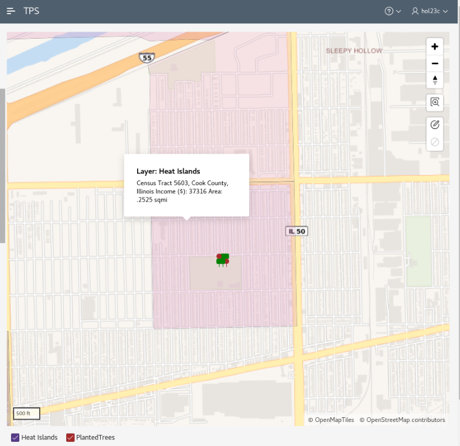
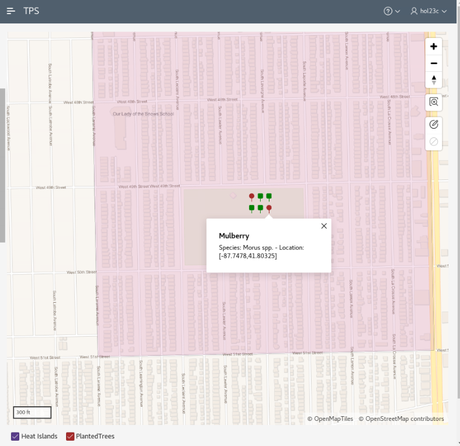

# Visualize Geospatial Data Within JSON Relational Duality Views

## Introduction

In this lab you will leverage Oracle APEX's Native Map Region to visualize the data captured within the set of JSON Relational Duality Views (JRDVs) you created earlier to show the progress of the volunteer teams in planting trees within designated heat islands.

Estimated Time: 5 minutes.

<!-- Watch the video below for a quick walk through of the lab. -->

<!-- update video link. Previous iteration: [](youtube:XnE1yw2k5IU) -->

### Objectives
Learn how to:
- Use Oracle APEX's Native Map Region to view a simple map that visualizes tree planting progress within Chicago's heat islands


### Prerequisites
This lab assumes you have:
- Oracle Database 23c Free Developer Release
- Completed all previous labs successfully
- ORDS still running so that you can run the sample APEX application

## Task 1: Create the APEX Environment

1. Return to the terminal window session you originally used to start ORDS and reset the password for the **hol23c** database user. If you need to open a terminal and you are running in a Sandbox environment, click on *Activities* and then *Terminal*.

    

2. Next, connect to your database.
    ```
    <copy>sqlplus / as sysdba</copy>
    ```
    

3. Run the following script from this terminal window:
    ```
    <copy>@/home/oracle/examples/create_apex_environment.sql;</copy>
    ```

    

    This script automates several tasks that would normally require an experienced APEX administrator to perform:
    - First, it sets up the proper environment for APEX configuration tasks.
    - It then creates a new APEX workspace named **TPS** that will store our sample APEX application.
    - Last, it imports the sample application into the new APEX workspace.

4. The script should complete within 10 seconds or less; you can now exit SQL Plus.
    ```
    <copy>exit</copy>
    ```
    

5. Just one final thing must be configured for APEX Native Map Regions to work properly: We need to inform APEX where to retrieve the standard Oracle base map images. To do that, we need to add the IP address and host name to our configuration's **/etc/hosts** file. Copy this command to a terminal window prompt and then execute it:
    ```
    <copy>sudo sh -c 'echo "173.223.146.112 elocation.oracle.com" >> /etc/hosts'</copy>
    ```
    You can validate the proper line has been added to /etc/hosts by issuing this command from a terminal window:

    ```
    <copy>cat /etc/hosts</copy>
    ```
    

## Task 2: Open the APEX Application
Now that our APEX environment is fully configured, we'll use the installed APEX application to view the current state of all tree plantings within the identified Chicago metropolitan heat islands.

1. Open Activities -> Google Chrome

    


2. Go to this URL and wait for the screen to load. Supply **TPS** for the workspace, **admin** for the username, and **Welcome123#** as the password.
    ```
    <copy>
    http://localhost:8080
    </copy>
    ```
    


3. Select the *App Builder* option.



4. Click on the **TPS** application to open the development environment for the APEX application.



5. Click on **Page 100 - Tree Planting Progress** to open the APEX application page.


6. Click on the green *Page Run* button near the top right hand corner of the page, right next to the *Save* button, to open the login screen for the application and run this page.



7. Since this APEX application uses database account authentication to access the database, supply **hol23c** for the login and supply the password you previously reset in Lab #2.


## Task 3: Visualize Tree Planting Progress Within Heat Islands 

1. Select page  **Heat Islands** page from the left-hand-side menu. A map of the Chicago metropolitan area, centered near many of the 25 heat islands identified and catalogued in the HEAT_ISLANDS table, is displayed.

2. Explore the map of Chicago-area heat islands just like you would explore any browser-based map:

- Move around the map and hover over a few of the heat islands displayed. You can use the +/- keys or CTL and your mouse wheel to increase or decrease the scale of the map, just as if it were a Google Maps or MapQuest web interface.

- Observe the intensity of the color scheme for these heat islands. The color scheme is based on the median income of the populous living within the heat island.

   

- Navigate to and then zoom into one of the heat islands that shows green, yellow, and red icons within them. The icons represent trees that were newly planted by the volunteer teams.

- If you click on the heat island polygon, some of its attributes - including its census tract information, median income levels, and area in square miles - will be displayed.  

   

- Finally, click on a few of the icons within the heat island to see attributes of the planted tree, including its common name and its precise latitude and longitude.
   
   


3. Close the application, return to the APEX development environment, and sign out.


. You have now completed this lab.

## Learn More
* [Oracle Database 23c: Spatial Concepts](https://docs.oracle.com/en/database/oracle/oracle-database/23/spatl/spatial-concepts.html#GUID-67E4037F-C40F-442A-8662-837DD5539784)
* [Oracle APEX 23.1: Creating Maps](https://docs.oracle.com/en/database/oracle/apex/23.1/htmdb/creating-maps.html#GUID-ACA5ED1C-7031-42BF-90B1-98938FB6DC17)


## Acknowledgements
* **Author** - Kaylien Phan, William Masdon, Jim Czuprynski
* **Contributors** - Jim Czuprynski, LiveLabs Contributor, Zero Defect Computing, Inc.
* **Last Updated By/Date** - Jim Czuprynski, July 2023