# Interact With ChatBot Application

## Introduction

We'll conclude this Live Lab with an exploration of various features within our imported APEX application that use various Oracle 23ai built-in generative AI features as well as explore how to use external AI providers to expand those capabilities.

**Estimated Time: 10 minutes**

### Objectives

In this lab, you will:

- Visualize patterns within the social media campaign's messaging via the *Graph Visualization Toolkit* (GVT) plug-in for APEX
- Identify messages with the most divergence between original and respondent postings
- Use generative AI tools to respond realistically to specific messages with different emotional tones and media formats

### Prerequisites

This lab assumes you:
- Have completed all previous labs successfully
- Are still connected to your APEX development environment as the **admin** user

## Task 1: Review Social Media Messaging Distribution
Let's take a quick look at some of the messages that were exchanged within our social media network. Each message's content as well as their relative positive or negative tone versus the originating message will be the focus of our planned response strategy.

1. Click on the *200 - Social Network* page to open that page.

  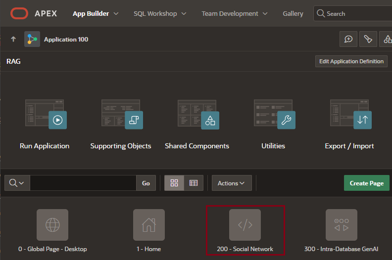

2. Click on *Run Page* icon next to the *Save* button near the top right of the page to run it.

  

3. Since we are using *database account authentication* to connect our APEX application to the database, supply **hol23** for the login and the password (which, unless you have changed it, should be **Future1sNow#**).

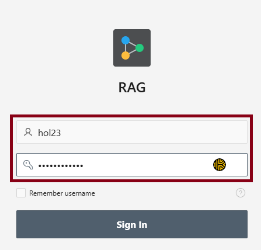

4. A graphic display of all messaging created as part of two different social media campaigns is displayed. Let's explore some of its visualization features.

  

    Hover your mouse pointer over one of the messages that is a deep blue color near the center of the social media messaging threads displayed. If you click the right mouse button, you'll see some information about the message, its sender, and [ finish ].  

    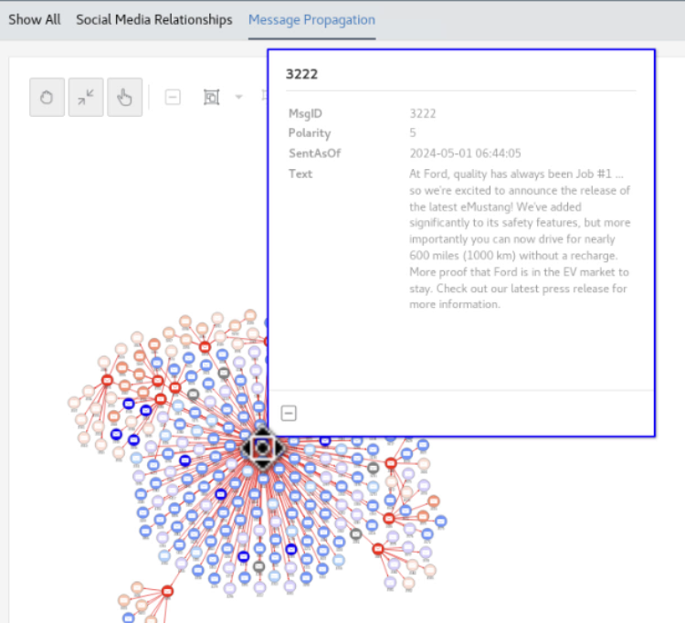

5. Note that responses that are generally more negative than the originally-posted messages are shaded grey, light red, or bright red.

  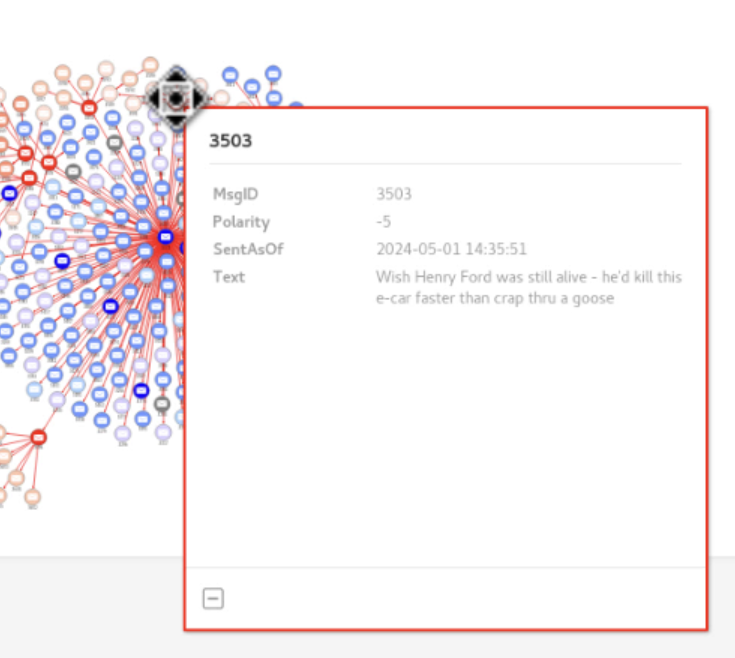

6. Now hover your mouse pointer over one of the messages that is a shade of deep red farther out on the peripherary of messaging threads displayed. If you click the right mouse button, you'll see some information about the message, its sender, and its polarity. Negative numbers represent message content that's derogatory or contains misinformation, and may even indicate the sender is a "troll." 

   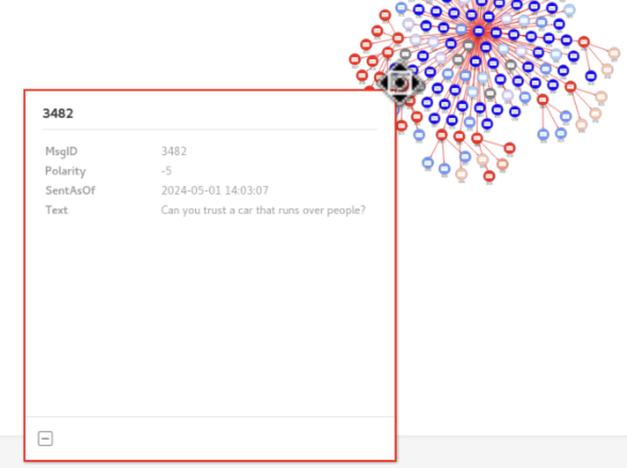

7. Sign out of the application. This will return focus to the APEX *Edit Page* window.

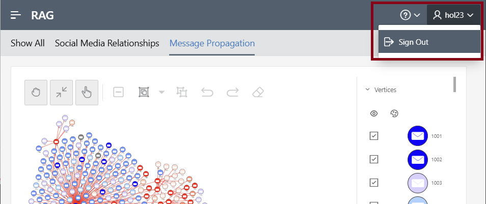

Unfortunately, we have limited time within this lab to explore the myriad features of the GVT plug-in, but if you are interested in learning more about its capabilities, please sign up for the LiveLabs titled *You Down With OPG? Leveraging Operational Property Graphs in Oracle 23ai.* It performs a much deeper dive into how to leverage the extensive Operational Property Graph features of 23ai in concert with the Graph Visualization Toolkit.

## Task 2: Configure OCI Generative AI Services
Now we'll configure our APEX application to use *OCI Generative AI* as its Generative AI Service provider.

1. Return to the *Home Edit* page for your APEX application and then click on the *Up arrow* in the top-left-hand corner. 

    

    From this menu, click the *Workspace Utilities* option.

    

    Then click on the *Generative AI* option.

    

2. A list of all configured Generative AI Services is displayed. Click the link for the one named *OCI Gen AI* to view its attributes.

    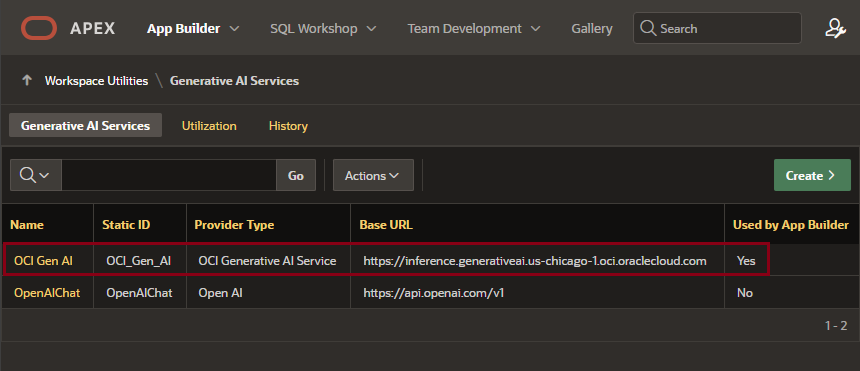

3. Adjust the attributes for the *OCI Gen AI* service that's already been configured for your application. 

    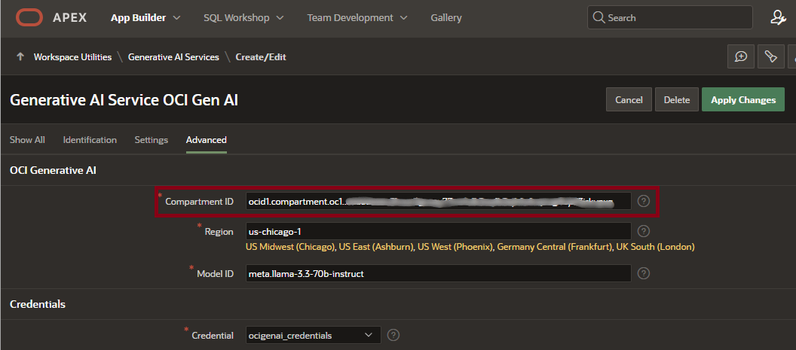

    - Copy the value for *Compartment ID* that you saved in the previous lab into the *Compartment ID* field. 

    - Note that the *Region* is **us-chicago-1** and the AI model it's configured to use is **meta-llama-3.3-70binstruct**. 
    
    - *No other changes are needed,* so now click the *Apply Changes* button.

4. Next, we'll reconfigure web credentials for the *OCI Gen AI* Service. Select the *Web Credentials* option.

    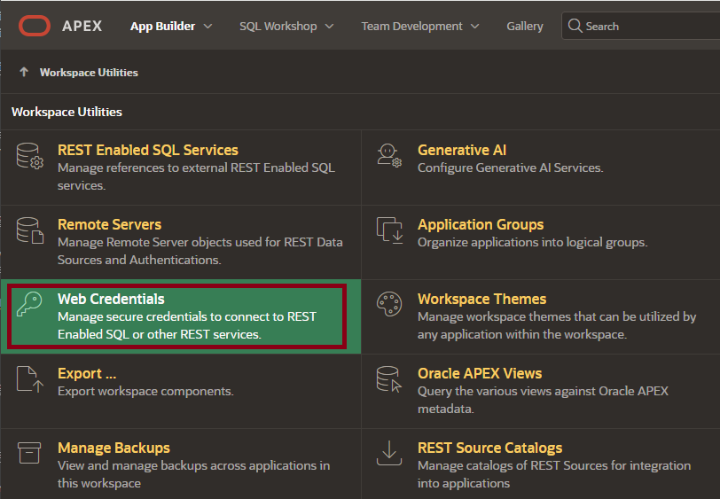

    The *OCI Gen AI* Generative AI Service uses the *OCI GenAI Credentials* web credential, so select that one.

    

    Modify the following values using the files you saved in the prior lab:

    - From the file you saved *in your editor of choice*, copy the values for *OCI User ID*, *OCI Tenancy ID*, and *OCI Public Key Footprint* into their corresponding fields.
    - From the file you saved *with a file extension of **PEM***, copy the entire private key string into the *OCI Private Key* field.
    - Click the *Apply Changes* button to save your modifications.

    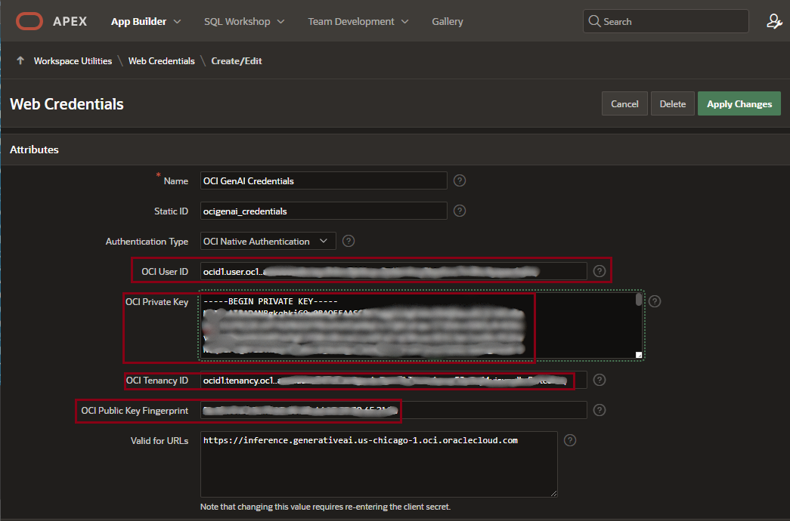

4. Return to the *Home Edit* page. Select the *Shared Components* option, then choose *Security Attributes* from the returned menu.

    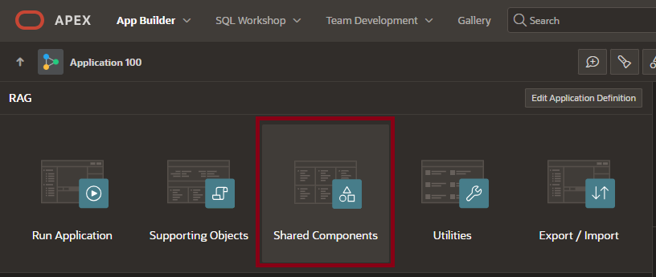

    

    Choose the *AI* option from the right-hand side of the top menu, and then choose *OCI Gen AI* as our AI Service provider. 

    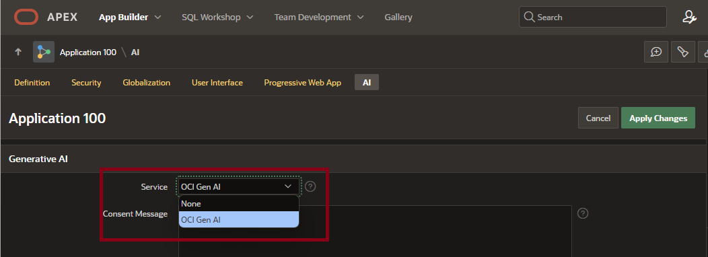

    Note that while multiple external AI service providers can be configured for APEX, only **one** can be utilized for the entire application. Click on *Apply Changes* to finish the dialog and return to the *Home Edit* page.

## Task 3: Exploring the Social Media Responder Generative AI Implementation

1. Click on the *Run Application* option to log into the application. Use **hol23** for the login and **Future1sNow#** for the password.

    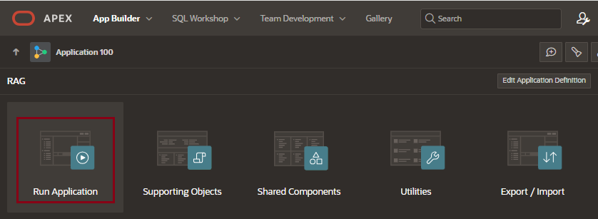

2. Within your application session, select the *Social Media Responder* option from the left-hand menu to open the page.

    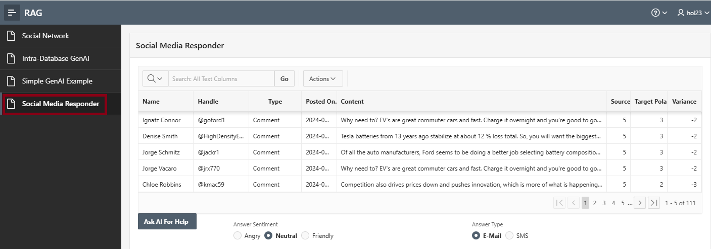

    If you want to limit the number of rows retrieved at one time by the report in the top region, you can reduce it by selecting the Actions drop-down list and select a lower number of rows as shown below. 

    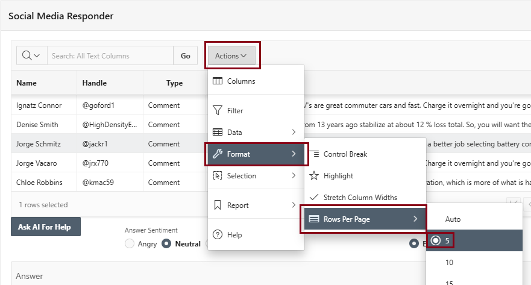

3. Let's explore this page a bit more. 

    - It uses an APEX *interactive report* to retrieve social media responses which were deemed *negative* relative to the original message posted.
    - It will to generate a response with a particular **sentiment** (*angry, neutral,* or *friendly*).
    - It will also generate the response in a ready-to-paste format as either an **email** (including the selected entity's *email address*) or an **SMS text** (including the selected entity's *social media handle*). 

    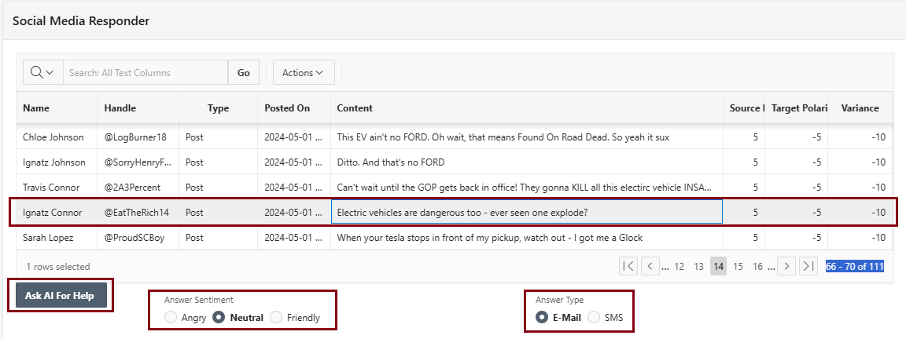

4. Here's an example of how the page works in real life. Based on relative source vs. target polarity ratings, we've chosen a particularly vehement reponse to a prior positive message, selected the desired sentiment and format, and then clicked on the *Ask AI For Help* button:

    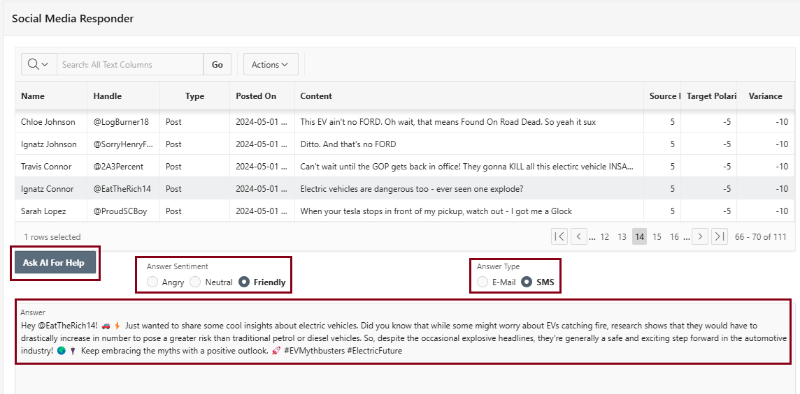

5. Let's see how the underlying code generates the prompt before submitting it to the OCI Generative AI service we've configured.  Edit Page 500 and expand the list of dynamic actions to review it:

    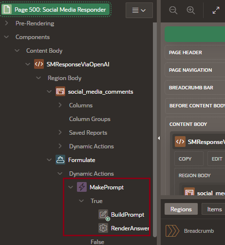

    - Click on the *Build Prompt* dynamic action and then open and expand the underlying *PL/SQL Function Body* that underlies it:

    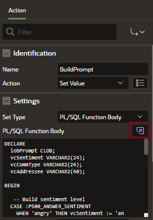

    - First, the function translates selected values for *Answer Sentiment* and *Answer Type* radio button groups into prompt directives.
    
    - Next, it captures either the appropriate *email address* or *social media handle* of the sender to which we'd be responding. Then, it constructs the prompt that will be sent to our specified generative AI service.

    - Note the call to the **pkg\_rag\_processing.summary\_document** PL/SQL package procedure. The code for that package is available in the scripts you downloaded (see **pkg-rag-processing.sql**). That procedure invokes logic to retrieve the top four approximate matches to the selected message text and returns those matching document chunks in paragraph format. 
    
    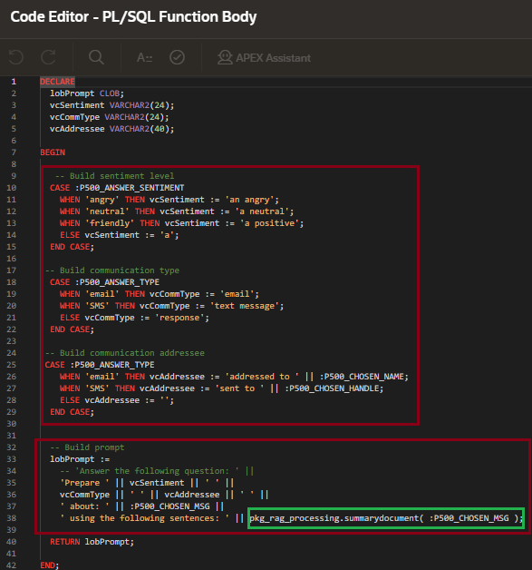

    - Finally, the code that the *RenderAnswer* process executes submits the engineered prompt to the OCI Generative AI service we've configured using the **APEX\_AI.GENERATE** procedure. OCI Generative AI then uses the specified generative AI model - in our case, **meta-llama-3.3-70b-instruct** - to perform some additional refinement of the response before it's returned for human review.

    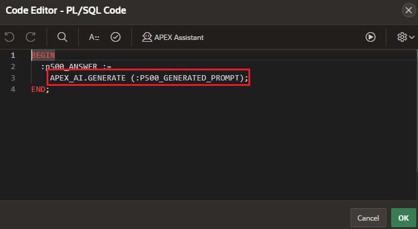

6. Feel free to explore the myriad messages presented here, choose a sentiment and format, and generate a response to the message to see how the generative AI aspects of the application work.

**You have now completed this Live Lab.** You may sign out of your Oracle 23ai ADB Always Free environment.

## Learn More
* [Property Graph Developer’s Guide](https://docs.oracle.com/en//database/oracle/property-graph/23.3/spgdg/index.htm)
* [Using the APEX Graph Visualization Plug-In](https://docs.oracle.com/en//database/oracle/property-graph/23.3/spgdg/visualizing-sql-graph-queries-using-apex-graph-visualization-plug.html)
* [Oracle Graph JavaScript API Reference for Property Graph Visualization](https://docs.oracle.com/en/database/oracle/property-graph/23.4/pgjsd/index.html)
* [APEX and Property Graphs in Oracle Database 23c (video)](https://www.youtube.com/watch?v=DODoJI3sR14)
* [Oracle Graph Learning Path](https://blogs.oracle.com/database/post/oracle-graph-learning-path)
* [Powering Network Topology Planning and Administration with Oracle Graph](https://blogs.oracle.com/database/post/powering-network-topology-planning-and-administration-with-oracle-graph)
* [Oracle Graph on Medium](https://medium.com/tag/oracle-graph)

## Scholarly Reading
* [Fame for sale: Efficient detection of fake Twitter followers](https://www.sciencedirect.com/science/article/abs/pii/S0167923615001803)
* [Social Media Sentiment Analysis](https://towardsdatascience.com/sentiment-analysis-74624b075842)
* [Detecting Fake Users on Social Media with a Graph Database](https://journals.uvic.ca/index.php/arbutus/article/view/20027)

## Acknowledgements
- **Author** - Jim Czuprynski, LiveLabs Contributor, Zero Defect Computing, Inc. 
* **Last Updated By/Date** - Jim Czuprynski, February 2025